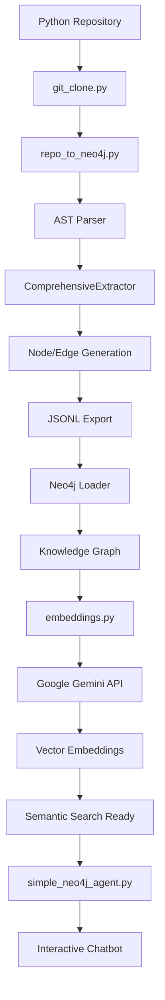

# 🚀 Python Repository to Neo4j Knowledge Graph Pipeline

[](https://www.python.org/downloads/)
[](https://neo4j.com/)
[](https://opensource.org/licenses/MIT)

> **Transform any Python repository into an intelligent, searchable knowledge graph with semantic embeddings powered by Google Gemini AI.**

A production-ready system that performs deep static analysis of Python codebases, creates comprehensive Neo4j knowledge graphs, and generates semantic embeddings for AI-powered code search and understanding.

---

## 📋 Table of Contents

- [Overview](#-overview)
- [Key Features](#-key-features)
- [Architecture](#-architecture)
- [Installation](#-installation)
- [Quick Start](#-quick-start)
- [Usage Examples](#-usage-examples)
- [Configuration](#-configuration)
- [Data Model](#-data-model)
- [Neo4j Queries](#-neo4j-queries)
- [Advanced Features](#-advanced-features)
- [Project Structure](#-project-structure)
- [Contributing](#-contributing)
- [License](#-license)
- [Authors](#-authors)

---

## 🎯 Overview

This pipeline automates the complete journey from Python source code to an intelligent knowledge graph:

```
Python Repository → AST Analysis → Graph Generation → Neo4j Loading → Semantic Embeddings → AI-Ready Database
```

### What Makes This Unique?

- **🧠 Semantic Intelligence**: Google Gemini embeddings for natural language code search
- **📊 Comprehensive Analysis**: Extracts 11+ node types and 10+ relationship types
- **🔄 End-to-End Automation**: Single command from repository to searchable graph
- **🌐 GitHub Integration**: Clone and analyze remote repositories directly
- **🎯 Production-Ready**: Robust error handling, batch processing, and resume capability
- **💡 Hybrid Database**: Combines graph structure with vector embeddings

---

## ✨ Key Features

### 🔍 Deep Code Analysis
- **AST-Based Extraction**: Complete Python syntax tree analysis
- **Rich Metadata**: Code metrics, complexity, docstrings, source code
- **Relationship Mapping**: Function calls, inheritance, imports, decorators
- **Docstring Parsing**: Google, NumPy, and reStructuredText formats
- **Scope Tracking**: Function-level and module-level context awareness

### 🗄️ Knowledge Graph Construction
- **11 Node Types**: Repository, Directory, File, Class, Function, Method, Variable, Parameter, Import, Decorator, Module
- **10 Relationship Types**: CONTAINS, DEFINES, CALLS, INHERITS, IMPORTS, USES, DECORATES, RETURNS, RAISES, HAS_PARAMETER
- **Hierarchical Structure**: Complete repository tree from root to code elements
- **External References**: Tracks dependencies and external library usage

### 🧠 Semantic Embeddings
- **Google Gemini Integration**: 3072-dimensional vector embeddings
- **Smart Text Generation**: Priority-based (Docstring → Code → Metadata)
- **Batch Processing**: Efficient handling of large codebases
- **Resume Capability**: Restart from interruption points
- **Status Tracking**: Complete verification and monitoring

### 🌐 GitHub Repository Support
- **Direct Cloning**: Analyze remote repositories without manual download
- **Branch Selection**: Specify custom branches for analysis
- **Automatic Cleanup**: Temporary directory management
- **Multi-Repository**: Analyze multiple projects sequentially

### 🚀 Production Features
- **Error Resilience**: Continues processing despite individual file errors
- **Incremental Updates**: Skip existing data with `--clean` option
- **Progress Reporting**: Real-time status updates and statistics
- **JSONL Export**: Structured data for external processing
- **Neo4j Aura Agent**: Interactive chatbot for graph queries

---

## 🏗️ Architecture

### System Components



### Core Modules

| Module | Purpose | Key Features |
|--------|---------|--------------|
| **repo_to_neo4j.py** | Main pipeline engine | AST analysis, graph generation, Neo4j loading |
| **embeddings.py** | Semantic intelligence | Google Gemini embeddings, batch processing |
| **git_clone.py** | Repository management | GitHub cloning, branch selection |
| **simple_neo4j_agent.py** | Interactive queries | Neo4j Aura chatbot integration |

---

## 📦 Installation

### Prerequisites

- **Python 3.8+** (Required for AST features)
- **Neo4j Database** (Local or Neo4j Aura)
- **Google API Key** (For embeddings)

### Step 1: Clone Repository

```bash
git clone https://github.com/SahiL911999/Python-Repository-to-Neo4j-Knowledge-Graph-Pipeline.git
cd Python-Repository-to-Neo4j-Knowledge-Graph-Pipeline
```

### Step 2: Install Dependencies

```bash
pip install -r requirements.txt
```

### Step 3: Configure Environment

Create a `.env` file in the project root:

```env
# Neo4j Configuration
NEO4J_URI=neo4j+ssc://your-instance.databases.neo4j.io
NEO4J_USERNAME=neo4j
NEO4J_PASSWORD=your_password

# Google Gemini API
GOOGLE_API_KEY=your_google_api_key

# Neo4j Aura Agent (Optional)
CLIENT_ID=your_client_id
CLIENT_SECRET=your_client_secret
ENDPOINT_URL=your_agent_endpoint
```

---

## 🚀 Quick Start

### Analyze a Local Repository

```bash
python repo_to_neo4j.py --repo /path/to/your/python/project
```

### Analyze a GitHub Repository

```bash
# Clone and analyze main branch
python repo_to_neo4j.py --remote_repo https://github.com/user/repo.git

# Analyze specific branch
python repo_to_neo4j.py --remote_repo https://github.com/user/repo.git --branch develop
```

### Generate Semantic Embeddings

```bash
# After loading to Neo4j, generate embeddings
python repo_to_neo4j.py --repo /path/to/project --with-embeddings
```

### Interactive Chatbot

```bash
# Query your knowledge graph with natural language
python simple_neo4j_agent.py
```

---

## 💡 Usage Examples

### Basic Analysis

```bash
# Analyze local repository
python repo_to_neo4j.py --repo ~/projects/django
```

**Output:**
```
================================================================================
PHASE 1: ANALYZING REPOSITORY & CREATING GRAPH DATA
================================================================================
📁 Repository: django
📂 Output: graph_data/django/
🔍 Found 1247 Python files
⚙️  Processing files...
✅ ANALYSIS COMPLETE
📊 Statistics:
   Files: 1247/1247
   Classes: 342
   Functions: 1891
   Methods: 3456
```

### Advanced Options

```bash
# Clean existing data and exclude directories
python repo_to_neo4j.py \
  --repo ~/projects/django \
  --clean \
  --exclude tests docs migrations \
  --with-embeddings

# Skip Neo4j loading (analysis only)
python repo_to_neo4j.py \
  --repo ./my_project \
  --skip-neo4j

# Force clear Neo4j database
python repo_to_neo4j.py \
  --repo ~/projects/flask \
  --force-clear \
  --with-embeddings
```

### GitHub Repository Analysis

```bash
# Analyze popular open-source projects
python repo_to_neo4j.py \
  --remote_repo https://github.com/pallets/flask.git \
  --branch main \
  --with-embeddings

python repo_to_neo4j.py \
  --remote_repo https://github.com/django/django.git \
  --branch stable/4.2.x
```

### Standalone Embedding Generation

```bash
# Generate embeddings for existing Neo4j data
python embeddings.py
```

**Output:**
```
============================================================
EMBEDDING FUNCTIONS
============================================================
Total functions to embed: 156

[1/156] Embedding calculate_total... ✓
[2/156] Embedding process_data... ✓
...
✓ Embedded: 156
✗ Failed: 0
```

---

## ⚙️ Configuration

### Command-Line Arguments

| Argument | Description | Example |
|----------|-------------|---------|
| `--repo` | Path to local Python repository | `--repo ~/projects/myapp` |
| `--remote_repo` | GitHub repository URL | `--remote_repo https://github.com/user/repo.git` |
| `--branch` | Git branch to analyze | `--branch develop` |
| `--output` | Custom output directory | `--output ./analysis_results` |
| `--exclude` | Directories to exclude | `--exclude tests .venv docs` |
| `--clean` | Clean existing data before analysis | `--clean` |
| `--skip-neo4j` | Skip Neo4j loading | `--skip-neo4j` |
| `--force-clear` | Auto-clear Neo4j database | `--force-clear` |
| `--with-embeddings` | Generate semantic embeddings | `--with-embeddings` |

### Environment Variables

```env
# Required for Neo4j
NEO4J_URI=neo4j+ssc://xxxxx.databases.neo4j.io
NEO4J_USERNAME=neo4j
NEO4J_PASSWORD=your_password

# Required for embeddings
GOOGLE_API_KEY=your_google_api_key

# Optional for Neo4j Aura Agent
CLIENT_ID=your_oauth_client_id
CLIENT_SECRET=your_oauth_client_secret
ENDPOINT_URL=https://api.neo4j.io/v1/agents/xxxxx
```

---

## 📊 Data Model

### Node Types

```python
Repository      # Root repository node
├── Directory   # Folder structure
│   └── File    # Python source files
│       ├── Class           # Class definitions
│       │   └── Method      # Class methods
│       ├── Function        # Standalone functions
│       ├── Variable        # Variables and constants
│       ├── Import          # Import statements
│       ├── Decorator       # Decorators
│       └── Parameter       # Function parameters
```

### Relationship Types

| Relationship | Description | Example |
|--------------|-------------|---------|
| `CONTAINS` | Hierarchical containment | `Directory -[:CONTAINS]-> File` |
| `DEFINES` | Definition relationships | `File -[:DEFINES]-> Function` |
| `CALLS` | Function call relationships | `Function -[:CALLS]-> Function` |
| `INHERITS` | Class inheritance | `Class -[:INHERITS]-> BaseClass` |
| `IMPORTS` | Import dependencies | `File -[:IMPORTS]-> Import` |
| `HAS_PARAMETER` | Parameter relationships | `Function -[:HAS_PARAMETER]-> Parameter` |
| `DECORATES` | Decorator applications | `Decorator -[:DECORATES]-> Function` |
| `RETURNS` | Return value tracking | `Function -[:RETURNS]-> Type` |
| `RAISES` | Exception handling | `Function -[:RAISES]-> Exception` |
| `USES` | Usage relationships | `Function -[:USES]-> Variable` |

### Node Properties

#### Function/Method Node
```json
{
  "id": "sha1_hash",
  "type": "Function",
  "name": "calculate_total",
  "qualified_name": "utils.calculate_total",
  "is_async": false,
  "parameters": [{"name": "items", "type": "List[float]"}],
  "return_type": "float",
  "docstring": "Calculate total with markup",
  "full_source_code": "def calculate_total(items):\n    ...",
  "metrics": {
    "lines_of_code": 15,
    "complexity": 3,
    "num_parameters": 1
  },
  "embedding_semantics": [0.123, 0.456, ...],  // 768-dim vector
  "embedding_status": "embedded"
}
```

---

## 🔍 Neo4j Queries

### Structural Queries

```cypher
-- Repository overview
MATCH path = (r:Repository)-[:CONTAINS|DEFINES*1..4]->(n)
RETURN path LIMIT 200

-- Function call graph
MATCH (f:Function)-[:CALLS]->(target)
RETURN f.name, collect(target.name) as calls

-- Class inheritance hierarchy
MATCH (c:Class)-[:INHERITS*]->(base)
RETURN c.name, collect(base.name) as inheritance_chain

-- Import dependencies
MATCH (f:File)-[:IMPORTS]->(i:Import)
WHERE NOT i.is_stdlib
RETURN f.name, collect(i.name) as external_deps

-- Complex functions (high complexity)
MATCH (f:Function)
WHERE f.metrics.complexity > 10
RETURN f.name, f.metrics.complexity
ORDER BY f.metrics.complexity DESC
```

### Semantic Search Queries

```cypher
-- Find similar functions by natural language
MATCH (f:Function)
WHERE f.embedding_semantics IS NOT NULL
CALL db.index.vector.queryNodes('function-embeddings', 5, 
  'database connection and error handling')
YIELD node, score
RETURN node.name, node.docstring, score

-- Search for authentication-related code
MATCH (n)
WHERE n.embedding_semantics IS NOT NULL
CALL db.index.vector.queryNodes('code-semantics', 10,
  'user authentication and password validation')
YIELD node, score
RETURN labels(node)[0] as type, node.name, score

-- Find classes related to data processing
MATCH (c:Class)
WHERE c.embedding_semantics IS NOT NULL
CALL db.index.vector.queryNodes('class-embeddings', 5,
  'data transformation and ETL pipeline')
YIELD node, score
RETURN node.name, node.docstring, score
```

### Analytics Queries

```cypher
-- Most called functions
MATCH (f:Function)<-[:CALLS]-(caller)
RETURN f.name, count(caller) as call_count
ORDER BY call_count DESC
LIMIT 10

-- Files with most dependencies
MATCH (f:File)-[:IMPORTS]->(i:Import)
RETURN f.name, count(i) as import_count
ORDER BY import_count DESC

-- Embedding coverage statistics
MATCH (n)
WHERE n.embedding_semantics IS NOT NULL
RETURN labels(n)[0] as node_type, count(n) as embedded_count
ORDER BY embedded_count DESC
```

---

## 🎯 Advanced Features

### 1. Docstring Parsing

Supports multiple docstring formats:

**Google Style:**
```python
def example(param1: str, param2: int) -> bool:
    """
    Short description.
    
    Args:
        param1 (str): Description of param1
        param2 (int): Description of param2
    
    Returns:
        bool: Description of return value
    
    Raises:
        ValueError: When param2 is negative
    """
```

**NumPy Style:**
```python
def example(param1, param2):
    """
    Short description.
    
    Parameters
    ----------
    param1 : str
        Description of param1
    param2 : int
        Description of param2
    
    Returns
    -------
    bool
        Description of return value
    """
```

### 2. Code Metrics

Automatically calculates:
- **Cyclomatic Complexity**: McCabe complexity metric
- **Lines of Code**: Function/method size
- **Nesting Depth**: Maximum indentation level
- **Parameter Count**: Number of function parameters
- **Branch Count**: Number of conditional branches
- **Loop Count**: Number of loops

### 3. Semantic Embedding Strategy

**Priority-Based Text Generation:**

1. **Docstring First** (Highest Priority)
   ```
   Function: calculate_total | Args: (items) | Returns: float
   Documentation: Calculate total with 10% markup
   ```

2. **Code Snippet** (Medium Priority)
   ```
   Function: calculate_total | Args: (items) | Returns: float
   Code: def calculate_total(items):
       return sum(item * 1.1 for item in items)
   ```

3. **Metadata Only** (Fallback)
   ```
   Function: calculate_total | Args: (items) | Returns: float
   ```

### 4. Neo4j Aura Agent Integration

Interactive chatbot for natural language queries:

```bash
python simple_neo4j_agent.py
```

**Example Conversation:**
```
You: What functions handle database connections?

Agent: Based on the knowledge graph, here are the functions that handle 
database connections:

1. connect_database() - Establishes connection to PostgreSQL
2. close_connection() - Safely closes database connections
3. execute_query() - Executes SQL queries with error handling

Would you like more details about any of these functions?
```

---

## 📁 Project Structure

```
python-repo-to-neo4j/
├── repo_to_neo4j.py          # Main pipeline engine
├── embeddings.py              # Google Gemini embedding generator
├── git_clone.py               # GitHub repository cloning
├── simple_neo4j_agent.py      # Neo4j Aura chatbot client
├── requirements.txt           # Python dependencies
├── .env.example               # Environment configuration template
├── LICENSE                    # MIT License
├── README.md                  # This file
├── TECHNICAL_ARCHITECTURE.md  # Detailed technical documentation
├── PROJECT_REPORT.md          # Comprehensive project report
├── graph_data/                # Generated graph data
│   └── <repository_name>/
│       ├── nodes.jsonl        # Node data
│       ├── edges.jsonl        # Edge data
│       └── stats.json         # Analysis statistics
└── docs/                      # Additional documentation
```

---

## 🤝 Contributing

We welcome contributions! Here's how you can help:

### Development Setup

```bash
# Clone repository
git clone https://github.com/SahiL911999/Python-Repository-to-Neo4j-Knowledge-Graph-Pipeline.git
cd Python-Repository-to-Neo4j-Knowledge-Graph-Pipeline

# Create virtual environment
python -m venv venv
source venv/bin/activate  # On Windows: venv\Scripts\activate

# Install development dependencies
pip install -r requirements.txt
pip install black flake8 mypy pytest

# Run tests
pytest tests/

# Format code
black .
flake8 .
```

### Contribution Guidelines

1. **Fork** the repository
2. **Create** a feature branch (`git checkout -b feature/amazing-feature`)
3. **Commit** your changes (`git commit -m 'Add amazing feature'`)
4. **Push** to the branch (`git push origin feature/amazing-feature`)
5. **Open** a Pull Request

### Areas for Contribution

- 🌐 **Multi-language support** (JavaScript, Java, C++)
- 🎨 **Web interface** for graph visualization
- 📊 **Additional metrics** and analysis features
- 🔌 **Plugin system** for custom analyzers
- 📚 **Documentation** improvements
- 🐛 **Bug fixes** and performance optimizations

---

## 📄 License

This project is licensed under the **MIT License** - see the [LICENSE](LICENSE) file for details.

```
MIT License

Copyright (c) 2025 Sahil Ranmbail

Permission is hereby granted, free of charge, to any person obtaining a copy
of this software and associated documentation files (the "Software"), to deal
in the Software without restriction, including without limitation the rights
to use, copy, modify, merge, publish, distribute, sublicense, and/or sell
copies of the Software, and to permit persons to whom the Software is
furnished to do so, subject to the following conditions:

The above copyright notice and this permission notice shall be included in all
copies or substantial portions of the Software.
```

---

## 👥 Authors

### **Sahil Ranmbail**
- 🎓 Lead Developer & Architect
- 📧 Email: [sahil.ranmbail@gmail.com](mailto:contact@sahil.ranmbail@gmail.com)
- 🔗 GitHub: [@SahiL911999](https://github.com/sahiL911999)
- 💼 LinkedIn: [Sahil Ranmbail](https://linkedin.com/in/sahil-ranmbail)

### Acknowledgments

Special thanks to:
- **Neo4j Team** for the excellent graph database platform
- **Google** for the Gemini AI embedding models
- **Python Community** for the robust AST module
- **Open Source Contributors** who inspire this work

---


## 📞 Support

- 📖 **Documentation**: [Technical Architecture](TECHNICAL_ARCHITECTURE.md)
- 📊 **Project Report**: [Comprehensive Report](PROJECT_REPORT.md)
- 🐛 **Issues**: [GitHub Issues](https://github.com/Sahil911999/python-repo-to-neo4j/issues)
- 💬 **Discussions**: [GitHub Discussions](https://github.com/sahiL911999/python-repo-to-neo4j/discussions)

---

## 🎉 Success Stories

> "This tool helped us understand our 10-year-old codebase in days instead of months. The semantic search is a game-changer!" - *Tech Lead, Fortune 500 Company*

> "Perfect for onboarding new developers. They can explore the codebase through natural language queries." - *Engineering Manager, Startup*

---

<div align="center">

**Made with ❤️ by Sahil Ranmbail**

[⬆ Back to Top](#-python-repository-to-neo4j-knowledge-graph-pipeline)

</div>
