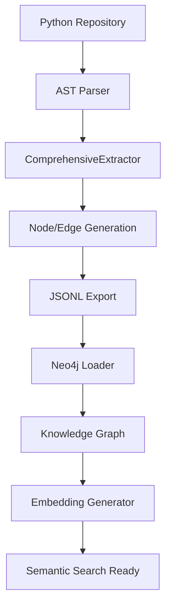

# Repository Analyzer - Technical Architecture Deep Dive

## 🏛️ System Architecture Overview



## 🔧 Core Components Deep Dive

### 1. AST Analysis Engine (`ComprehensiveExtractor`)

#### Visitor Pattern Implementation
```python
class ComprehensiveExtractor(ast.NodeVisitor):
    """
    Implements the Visitor pattern for AST traversal
    - Maintains context stack for proper scoping
    - Tracks imports and name resolution
    - Extracts comprehensive metadata
    """
```

#### Key Processing Methods:
- `visit_FunctionDef()` - Function analysis with metrics
- `visit_ClassDef()` - Class hierarchy and inheritance
- `visit_Import()` - Dependency tracking
- `visit_Call()` - Function call relationships
- `visit_Assign()` - Variable definitions

#### Context Management:
```python
self.current_scope_stack: List[str] = []  # Hierarchical scope tracking
self.imports_map: Dict[str, str] = {}     # Import resolution
self.defined_names: Dict[str, str] = {}   # Name to ID mapping
```

### 2. Data Model Architecture

#### Node Structure:
```python
{
    "id": "sha1_hash",           # Unique identifier
    "type": "NodeType",          # Enum-based type system
    "name": "element_name",      # Human-readable name
    "metadata": {...},           # Type-specific attributes
    "embedding_semantics": "...", # Text for AI embedding
    "metrics": {...}             # Code quality metrics
}
```

#### Edge Structure:
```python
{
    "type": "EdgeType",          # Relationship type
    "from_id": "source_id",      # Source node ID
    "to_id": "target_id",        # Target node ID (optional)
    "to_name": "target_name",    # Target name (for external refs)
    "metadata": {...}            # Relationship-specific data
}
```

### 3. Embedding Generation Pipeline

#### Text Generation Strategy:
```python
def generate_embedding_text(node_type: str, **kwargs) -> str:
    """
    Priority-based text generation:
    1. Docstring (rich documentation)
    2. Code snippet (implementation details)
    3. Metadata only (structural information)
    """
```

#### Processing Flow:
1. **Query Neo4j** for nodes with text embeddings
2. **Filter** nodes that need vector embeddings
3. **Generate** OpenAI embeddings with rate limiting
4. **Update** Neo4j with vector embeddings
5. **Verify** embedding completion status

## 🗄️ Data Storage Architecture

### JSONL Format Structure
```
graph_data/
├── repository_name/
│   ├── nodes.jsonl      # One node per line
│   ├── edges.jsonl      # One edge per line
│   └── stats.json       # Analysis statistics
```

### Neo4j Schema Design

#### Node Labels:
- `Repository` - Root repository node
- `Directory` - Folder structure
- `File` - Python source files
- `Class` - Class definitions
- `Function` - Standalone functions
- `Method` - Class methods
- `Variable` - Variables and constants
- `Parameter` - Function parameters
- `Import` - Import statements
- `Decorator` - Function/class decorators

#### Relationship Types:
- `CONTAINS` - Hierarchical containment
- `DEFINES` - Definition relationships
- `CALLS` - Function call relationships
- `INHERITS` - Class inheritance
- `IMPORTS` - Import dependencies
- `HAS_PARAMETER` - Parameter relationships
- `DECORATES` - Decorator applications

## 🔄 Processing Pipeline Details

### Stage 1: Repository Discovery
```python
def build_directory_tree(root: Path, exclude: List[str]) -> Tuple[...]:
    """
    - Recursive directory traversal
    - Exclusion pattern matching
    - Python file identification
    - Directory structure mapping
    """
```

### Stage 2: File Analysis
```python
def extract_file(repo_root: Path, file_path: Path) -> Tuple[...]:
    """
    - UTF-8 encoding handling
    - AST parsing with error recovery
    - Comprehensive extraction
    - Statistics collection
    """
```

### Stage 3: Graph Construction
```python
def process_repository(repo_path: Path, output_dir: Path) -> Dict:
    """
    - Multi-file coordination
    - Node/edge aggregation
    - JSONL serialization
    - Statistics generation
    """
```

### Stage 4: Neo4j Integration
```python
def load_to_neo4j(data_dir: Path) -> bool:
    """
    - Connection validation
    - Batch loading optimization
    - Transaction management
    - Error recovery
    """
```

## 🧠 Semantic Intelligence Layer

### Embedding Text Generation

#### Function/Method Embeddings:
```python
# Priority: Docstring → Code → Metadata
text = f"Function: {name} | Args: ({params}) | Returns: {return_type}"
if docstring:
    text += f" | Documentation: {docstring}"
elif code_snippet:
    text += f" | Code: {snippet}"
```

#### Class Embeddings:
```python
# Priority: Docstring → Code → Inheritance
text = f"Class: {name}"
if inheritance:
    text += f" | Inherits: {', '.join(bases)}"
if docstring:
    text += f" | Documentation: {docstring}"
```

#### File Embeddings:
```python
# Module-level context
text = f"File: {name} | Module: {module_name}"
if module_docstring:
    text += f" | Documentation: {docstring}"
```

### OpenAI Integration
```python
def get_embedding(text: str) -> List[float]:
    """
    - Model: text-embedding-3-large (3072 dimensions)
    - Rate limiting: 1 second delays
    - Error handling: Graceful failure
    - Retry logic: Manual restart capability
    """
```

## 🔍 Query Architecture

### Neo4j Query Patterns

#### Structural Queries:
```cypher
-- Repository overview
MATCH path = (r:Repository)-[:CONTAINS|DEFINES*1..4]->(n)
RETURN path LIMIT 200

-- Function relationships
MATCH (f:Function)-[:CALLS]->(target)
RETURN f.name, collect(target.name) as calls

-- Class hierarchy
MATCH (c:Class)-[:INHERITS*]->(base)
RETURN c.name, collect(base.name) as inheritance_chain
```

#### Semantic Queries:
```cypher
-- Similar functions (requires vector index)
MATCH (f:Function)
WHERE f.embedding_semantics IS NOT NULL
CALL db.index.vector.queryNodes('function_embeddings', 10, $query_vector)
YIELD node, score
RETURN node.name, node.docstring, score
```

## 🚀 Performance Optimizations

### Memory Management
- **Streaming Processing**: JSONL line-by-line reading
- **Batch Operations**: Neo4j bulk loading
- **Context Cleanup**: Proper scope stack management
- **Generator Usage**: Memory-efficient iteration

### Processing Efficiency
- **AST Caching**: Reuse parsed trees when possible
- **Parallel Processing**: Multi-file analysis capability
- **Incremental Updates**: Skip existing data
- **Error Isolation**: Continue processing despite failures

### Database Optimization
- **Index Strategy**: Automatic index creation on IDs
- **Batch Size**: Optimized transaction sizes
- **Connection Pooling**: Efficient connection reuse
- **Query Optimization**: Efficient relationship traversal

## 🔒 Security & Reliability

### Error Handling Strategy
```python
try:
    # Risky operation
    result = process_file(file_path)
except SyntaxError as e:
    log_error(f"Syntax error in {file_path}: {e}")
    continue  # Skip problematic files
except Exception as e:
    log_error(f"Unexpected error: {e}")
    # Graceful degradation
```

### Data Integrity
- **SHA1 Hashing**: Consistent node identification
- **Foreign Key Validation**: Relationship integrity
- **Transaction Safety**: Atomic operations
- **Rollback Capability**: Error recovery

### Security Measures
- **Environment Variables**: Secure credential storage
- **API Key Protection**: No hardcoded secrets
- **Input Validation**: Safe file path handling
- **SQL Injection Prevention**: Parameterized queries

## 📊 Monitoring & Observability

### Statistics Tracking
```python
{
    "total_files": 22,
    "files_processed": 22,
    "files_with_errors": 0,
    "total_functions": 10,
    "total_methods": 59,
    "total_classes": 17,
    "analysis_timestamp": "2025-10-29T16:37:28.375076"
}
```

### Progress Reporting
- **Real-time Updates**: Processing progress display
- **Error Logging**: Detailed error information
- **Performance Metrics**: Processing time tracking
- **Completion Status**: Success/failure reporting

### Debugging Support
- **Verbose Logging**: Detailed operation logs
- **Stack Traces**: Full error context
- **State Inspection**: Current processing state
- **Recovery Information**: Restart guidance

## 🔮 Extensibility Architecture

### Plugin System Design
```python
class AnalyzerPlugin:
    """Base class for language-specific analyzers"""
    def analyze_file(self, file_path: Path) -> Tuple[List[Dict], List[Dict]]:
        raise NotImplementedError
```

### Configuration System
```python
@dataclass
class AnalysisConfig:
    exclude_patterns: List[str]
    include_patterns: List[str]
    max_file_size: int
    enable_embeddings: bool
    embedding_provider: str
```

### Future Enhancement Points
- **Multi-language Support**: JavaScript, Java, C++ analyzers
- **Custom Metrics**: User-defined code quality metrics
- **Plugin Architecture**: Third-party analyzer integration
- **API Server**: REST API for programmatic access
- **Web Interface**: Browser-based repository exploration

This technical architecture provides a solid foundation for understanding how the Repository Analyzer transforms Python codebases into intelligent, searchable knowledge graphs with comprehensive semantic understanding.